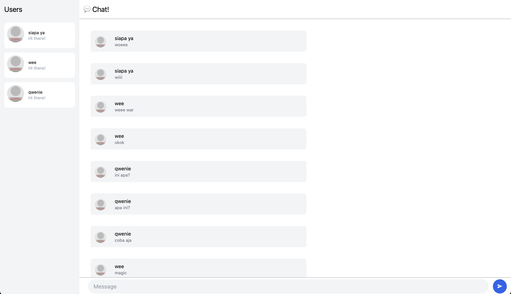

### Experiment 3.1: Original code

Dapat dilihat setelah melakukan `npm run`, kita dapat melakukan chatting pada suatu website dengan gui yang diberikan. Saya disini menggunakan 3 user untuk memperlihatkan bagaimana hasil chat tersebut dikirim dan dapat dilihat hal ini mirip seperti tutorial sebelumnya yaitu client dengan server.

### Experiment 3.2: Be Creative!

Perubahan yang saya lakukan:
Saya telah mengganti beberapa warna background dan teks untuk memberikan kontras dan kesan minimalis pada aplikasi chat tersebut. Selain itu saya juga menambahkan shadow-lg dan rounded-lg untuk memberikan kedalaman dan kesan smoooth pada tampilan. Saya juga menambahkan efek hover dan focus pada input. Saya juga mengganti warna tombol submit yang dengan warna yang lebih cerah untuk tombol submit agar lebih menarik. Selain itu, saya juga mengganti warna background chat agar menjadi lebih menarik.